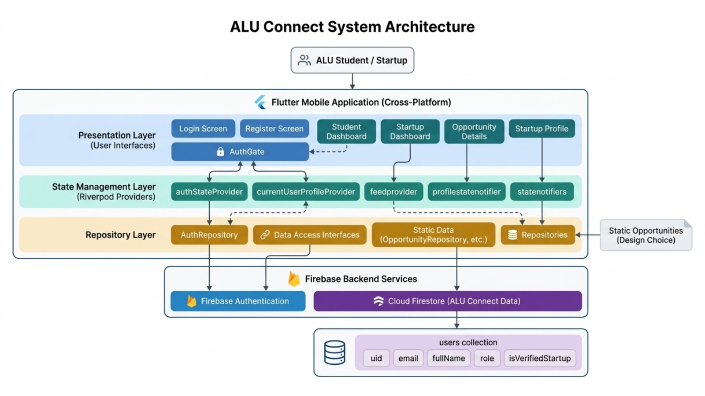

# ALU-Connect Mobile Application

ALU-Connect is a Flutter mobile application that connects ALU students seeking internships with startups and early-stage ventures verified by ALU. It allows startups to publish opportunities and students to discover, apply for, and track internship experiences.

---

## Overview

ALU-Connect was built to solve the challenge of connecting student talent with meaningful startup opportunities. Students can browse internships, view role requirements, submit applications, and track progress, while startups can create profiles, post opportunities, and review applicants.

The app uses Flutter for cross-platform mobile development, Firebase Authentication and Cloud Firestore for backend services, and Riverpod for reactive state management. The codebase follows a layered architecture designed for maintainability, scalability, and clear separation between the user interface, application logic, and backend communication.

---

## Features

- Role-based authentication for students and startups.
- Startup account registration and login.
- Internship/opportunity creation and editing.
- Student discovery feed with search and application flow.
- Application tracking with instant UI updates.
- Firebase-backed live synchronization between mobile and database.
- Startup applicant tracking dashboard.
- Profile, settings, and notifications-related screens for extended user workflows.

---

## [UI Design](https://canva.link/skiabxl70sigdii)

---

## [Watch App Demo](https://canva.link/u7ugs66kpx04orl)

---

## System Architecture

ALU-Connect follows a layered architecture to keep the codebase clean and easy to maintain. The presentation layer contains Flutter screens and reusable widgets, Riverpod manages reactive application state, the repository layer handles backend communication, and Firebase provides authentication and cloud data storage.

This is the system architecture diagram:


The architecture supports future scalability and makes it easier to add features such as notifications, messaging, recommendation systems, interview scheduling, and analytics dashboards.

---

## Setup

### Prerequisites
- Flutter SDK installed.
- Dart installed.
- Firebase project created.
- Android Studio, VS Code, or another Flutter-compatible IDE.
- A connected device or emulator.

### Clone the repository
```bash
git clone <https://github.com/m-dhieu/ALU-Connect>
cd ALU-Connect
```

### Install dependencies
```bash
flutter pub get
```

### Configure Firebase
1. Create a Firebase project.
2. Enable **Firebase Authentication**.
3. Create a **Cloud Firestore** database.
4. Add your Flutter app to Firebase.
5. Download the configuration files:
   - `google-services.json` for Android
   - `GoogleService-Info.plist` for iOS
6. Place the files in the correct platform folders.

### Run the app
```bash
flutter run
```

### Optional: Run tests
```bash
flutter test
```

---

## Testing

Testing was done through widget testing, manual testing, and Firebase validation. Widget tests verified UI rendering, form validation, and interaction responses, while manual testing covered authentication, opportunity discovery, startup posting, application submission, and tracking workflows.

---

## Future Improvements

Planned improvements include:
- Firebase Cloud Messaging notifications.
- Student-startup messaging.
- Skill-based recommendation systems.
- Interview scheduling workflows.
- Engagement analytics dashboards.

---

## Limitations

Current limitations include:
- Startup verification still depends on controlled ecosystem access rather than automated verification.
- Recommendation systems are not yet implemented.
- Notifications and messaging require additional backend services.
- Some workflows can still be expanded with richer analytics.

---

## AI Assistance Used

AI tools were used to help with:
- Debugging
- Testing
- Organizing the README structure.
- Improving wording and formatting for project documentation.
- Drafting clearer explanations of the app’s architecture, setup, and demo flow.

---

## References

- Flutter Documentation: [https://flutter.dev/docs](https://flutter.dev/docs).
- Firebase Documentation: [https://firebase.google.com/docs](https://firebase.google.com/docs).
- Riverpod Documentation: [https://riverpod.dev/](https://riverpod.dev/).

---

## License
This project is under the MIT License.

---

## Author

Monica Moses

---

*Sunday, July 12, 2026*
